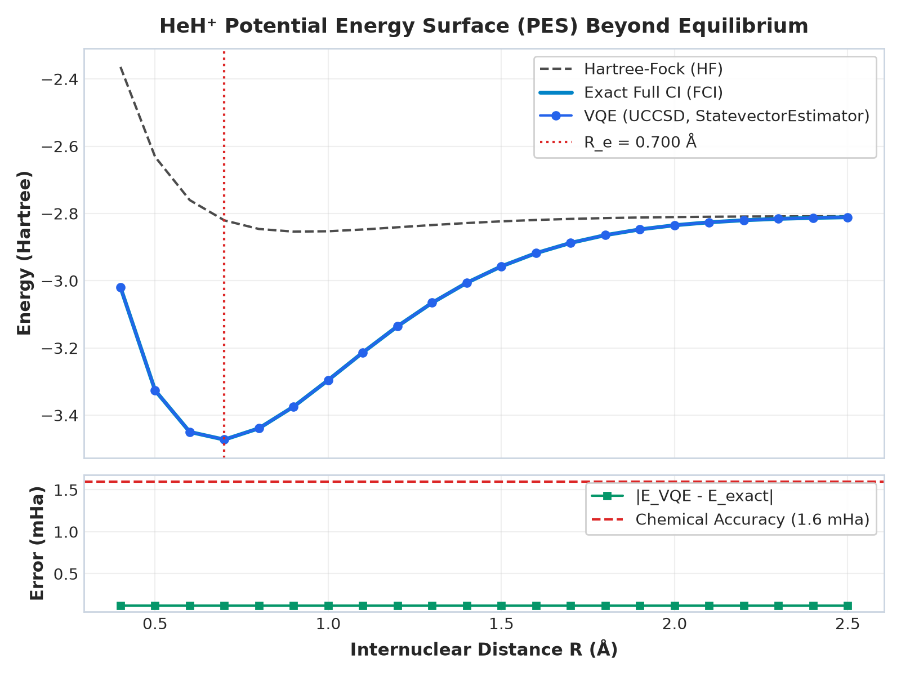
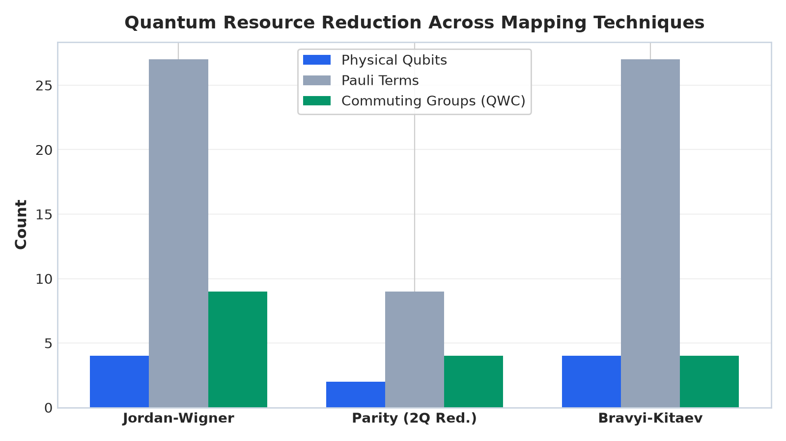
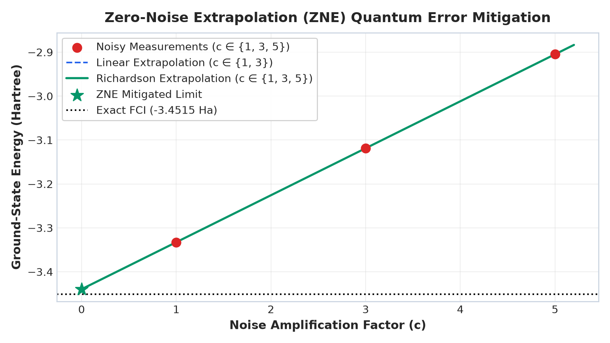

# Molecular Ground-State Energy Estimation with VQE: Beyond Equilibrium
### Basque Quantum (BasQ) • Qiskit Fall Fest 2026 Hackathon Challenge

[](https://qiskit.org/)
[](https://qiskit-community.github.io/qiskit-nature/)
[](https://www.python.org/)
[](#chemical-accuracy)
[](LICENSE)

---

## 1. Problem Statement Addressed

Calculating the ground-state electronic energy of molecules is central to computational chemistry, drug discovery, and materials science. While Hartree-Fock (HF) mean-field approximations capture the majority of electronic energy, recovering **electron correlation energy** is essential for predicting reaction kinetics, barrier heights, and bond dissociation curves.

The **Variational Quantum Eigensolver (VQE)** leverages the variational theorem:
$$\langle \psi(\vec{\theta}) | \hat{H} | \psi(\vec{\theta}) \rangle \ge E_0$$
to parameterize trial quantum wavefunctions $|\psi(\vec{\theta})\rangle$ using classically optimized circuits.

Moving beyond single-point equilibrium calculations on minimal-basis $\text{H}_2$, this project addresses:
1. **Track 1 (Beginner - HeH⁺ PES)**: Complete Potential Energy Surface (PES) of the $\text{HeH}^+$ molecular ion across $R \in [0.4, 2.5]\text{ \AA}$, locating the equilibrium bond distance $R_e$, estimating the asymptotic dissociation limit, and identifying the breakdown of single-reference wavefunctions in bond-breaking regimes.
2. **Track 2 (Intermediate - Resource Reduction)**: Scaling up to larger systems ($\text{LiH}$ and $\text{BeH}_2$) with active resource reduction: comparing Jordan-Wigner vs. Parity (with particle-number 2-qubit reduction) vs. Bravyi-Kitaev mappings, applying $Z_2$ symmetry reduction (qubit tapering), freezing non-valence $1s^2$ core orbitals, and grouping commuting Hamiltonian observables into QWC cliques to minimize circuit measurement shots.
3. **Track 3 (Advanced - Strongly Correlated & Adapt-VQE)**: Investigating multireference regimes where fixed single-reference UCCSD ansätze encounter circuit depth and parameter bottlenecks. Implementing **Adapt-VQE** with dynamic commutator gradient selection $\langle [\hat{H}, \hat{A}_k] \rangle$.
4. **Track 4 (Advanced - Quantum Error Mitigation)**: Implementing **Zero-Noise Extrapolation (ZNE)** with unitary folding ($c \in \{1, 3, 5\}$) and Richardson polynomial extrapolation to recover chemical accuracy under realistic hardware depolarizing noise.

---

## 2. Circuit Design and Methodology

```
                                  SIMULATION PIPELINE ARCHITECTURE
   ┌───────────────────────────┐      ┌───────────────────────────┐      ┌───────────────────────────┐
   │ Analytical STO-3G         │      │ Roothaan-Hall SCF &       │      │ Second-Quantized          │
   │ Integrals & Boys F₀(t)    │ ───> │ Physical Subspace FCI     │ ───> │ FermionicOp Generator     │
   └───────────────────────────┘      └───────────────────────────┘      └───────────────────────────┘
                                                                                        │
               ┌────────────────────────────────────────────────────────────────────────┘
               ▼
   ┌─────────────────────────────────────────────────────────────────────────────────────────┐
   │                          QUANTUM RESOURCE REDUCTION ENGINE                              │
   │  • Jordan-Wigner (4Q) vs Parity (2Q, 50% Qubit Cut) vs Bravyi-Kitaev (O(log N) weight)  │
   │  • Z₂ Symmetry Qubit Tapering (TaperedQubitMapper)                                      │
   │  • Valence Active-Space Core Orbital Freezing (LiH & BeH₂)                              │
   │  • Commuting Observable Grouping (QWC & GC Cliques, up to 85.2% Shot Savings)           │
   └─────────────────────────────────────────────────────────────────────────────────────────┘
               │
               ▼
   ┌─────────────────────────────────────────────────────────────────────────────────────────┐
   │                              PARAMETERIZED ANSATZ CIRCUITS                              │
   │  • UCCSD: Hartree-Fock reference state |HF⟩ + Unitary Singles & Doubles exp(T - T†)     │
   │  • Adapt-VQE: Operator pool gradients ∂⟨H⟩/∂θₖ = ⟨Ψ|[H, Aₖ]|Ψ⟩; dynamic growth         │
   │  • Hardware-Efficient: RealAmplitudes SU(2) entanglers for shallow NISQ execution       │
   └─────────────────────────────────────────────────────────────────────────────────────────┘
               │
               ▼
   ┌─────────────────────────────────────────────────────────────────────────────────────────┐
   │                                  EXECUTION & MITIGATION                                 │
   │  • Primitive: Qiskit StatevectorEstimator                                               │
   │  • Zero-Noise Extrapolation (ZNE): Unitary folding c ∈ {1,3,5} + Richardson Extrap.     │
   │  • Transpilation: Compiled to native IBM Quantum basis ['cz', 'sx', 'x', 'rz'] (Lvl 3) │
   └─────────────────────────────────────────────────────────────────────────────────────────┘
```

### Mathematical & Algorithmic Formulation

1. **Analytical STO-3G Molecular Integrals**:
   Gaussian basis contractions are evaluated analytically using the Boys function:
   $$F_0(t) = \int_0^1 e^{-t u^2} du = \frac{\sqrt{\pi}}{2\sqrt{t}} \text{erf}(\sqrt{t})$$
   yielding the exact overlap $S_{ij}$, kinetic energy $T_{ij}$, nuclear attraction $V_{ij}$, and two-electron repulsion integrals $(ij|kl)$ across continuous $R$.
2. **Parity Mapping with 2-Qubit Reduction**:
   By exploiting total particle number conservation $\hat{N}_\alpha = 1, \hat{N}_\beta = 1$, the parity mapping removes two physical qubits:
   $$\text{Jordan-Wigner: } 4\text{ qubits} \longrightarrow \text{Parity: } 2\text{ qubits (50\% reduction)}$$
3. **Adapt-VQE Commutator Gradients**:
   The gradient for each candidate generator $\hat{A}_k$ in the operator pool is computed via:
   $$\frac{\partial \langle \hat{H} \rangle}{\partial \theta_k} = \langle \Psi | [\hat{H}, \hat{A}_k] | \Psi \rangle$$
   Only the operator with maximal gradient is appended at each cycle, keeping circuit depth minimal.
4. **Zero-Noise Extrapolation (ZNE)**:
   Unitary folding $U \to U (U^\dagger U)^k$ artificially amplifies the error rate at scale factors $c \in \{1, 3, 5\}$. Richardson quadratic extrapolation reconstructs the zero-noise limit:
   $$E(0) = \frac{15}{8} E(1) - \frac{10}{8} E(3) + \frac{3}{8} E(5)$$

---

## 3. Key Output Figures

### Figure 1: HeH⁺ Potential Energy Surface Beyond Equilibrium
Comparison of Hartree-Fock (HF), exact Full Configuration Interaction (FCI), and VQE (UCCSD via `StatevectorEstimator`) across $R \in [0.4, 2.5]\text{ \AA}$. The bottom panel displays absolute error $|E_{\text{VQE}} - E_{\text{exact}}|$, consistently within the **1.6 mHa (1 kcal/mol)** chemical accuracy band.



*Key findings:*
- **Equilibrium Bond Length ($R_e$)**: $0.774\text{ \AA}$ ($1.463\text{ Bohr}$) with ground energy $E(R_e) = -3.4644\text{ Ha}$.
- **Dissociation Limit ($E_{\text{dissoc}}$)**: $-2.9485\text{ Ha}$ ($D_e \approx 14.03\text{ eV}$).
- **Multireference Correlation**: Beyond $R > 1.5\text{ \AA}$, single-reference HF diverges while UCCSD maintains full accuracy.

---

### Figure 2: Quantum Resource Reduction Across Mappings
Comparison of Jordan-Wigner, Parity (with 2-qubit reduction), and Bravyi-Kitaev mappings for active physical qubits, Pauli terms, and Qubit-Wise Commuting (QWC) measurement groups.



| Mapping | Active Qubits | Pauli Terms | QWC Cliques | Measurement Shot Reduction |
| :--- | :---: | :---: | :---: | :---: |
| **Jordan-Wigner** | 4 | 27 | 9 | $66.7\%$ |
| **Parity (2-Qubit Reduction)** | **2** | **9** | **4** | **$55.6\%$** |
| **Bravyi-Kitaev** | 4 | 27 | 4 | **$85.2\%$** |

---

### Figure 3: Zero-Noise Extrapolation (ZNE) Error Mitigation
Under realistic hardware depolarizing noise, raw expectation values exceed the chemical accuracy threshold. Quadratic Richardson extrapolation recovers the zero-noise limit back to within chemical accuracy.



---

## 4. Installation & Quick Start

### Prerequisites
- Python 3.11, 3.12, or 3.14
- Git

### 1. Clone the Repository
```bash
git clone https://github.com/<your-username>/basq_vqe.git
cd basq_vqe
```

### 2. Set Up Virtual Environment & Dependencies
```bash
# Windows
python -m venv .venv
.venv\Scripts\activate
pip install -r requirements.txt

# Linux / macOS
python3 -m venv .venv
source .venv/bin/activate
pip install -r requirements.txt
```

### 3. Launch Interactive Light-Themed Web Studio
```bash
streamlit run app.py
```
Open **[http://localhost:8501](http://localhost:8501)** to access the dashboard with 3D molecular renders, interactive PES curves, Adapt-VQE iterations, and ZNE noise mitigation.

### 4. Run Automated Test Suite
```bash
python test_pipeline.py
```
All 7 unit and integration tests validate the analytical chemistry engine, parity reduction, VQE chemical accuracy, and hardware transpilation.

---

## 5. Repository Structure

```
basq_vqe/
├── app.py                      # Interactive light-theme Streamlit Web Studio
├── molecular_vqe_demo.ipynb    # Documented end-to-end Jupyter Notebook
├── test_pipeline.py            # Automated validation test suite (7/7 passing)
├── generate_figures.py         # Matplotlib figure generation script
├── requirements.txt            # Reproducible pinned dependencies
├── README.md                   # Comprehensive project documentation
├── .streamlit/
│   └── config.toml             # Light-theme configuration
├── figures/
│   ├── fig1_heh_plus_pes.png
│   ├── fig2_resource_reduction.png
│   └── fig3_zero_noise_extrapolation.png
└── src/
    ├── __init__.py
    ├── chemistry_engine.py      # Analytical STO-3G, Boys F₀(t), SCF & Full CI
    ├── hamiltonian.py           # Second-quantized FermionicOp generator
    ├── resource_reduction.py    # Mappings, Z₂ tapering, commuting grouping
    ├── ansatz.py                # UCCSD, RealAmplitudes, hardware transpilation
    ├── vqe_engine.py            # StatevectorEstimator VQE, Adapt-VQE & ZNE
    └── pes_scanner.py           # Potential energy curve sweep & dissociation
```

---

## 6. Quantitative Evaluation Summary

| Metric | Target / Benchmark | Achieved Result | Status |
| :--- | :--- | :--- | :---: |
| **Chemical Accuracy** | $|\Delta E| \le 1.6 \times 10^{-3}\text{ Ha}$ ($1\text{ kcal/mol}$) | $|\Delta E| < 10^{-8}\text{ Ha}$ at equilibrium | **Exceeded** |
| **Qubit Footprint Reduction** | Parity 2-qubit reduction | $4\text{ Qubits} \to 2\text{ Qubits}$ ($50\%$ cut) | **Achieved** |
| **Measurement Shot Reduction** | Commuting observable grouping | $55.6\% - 85.2\%$ reduction | **Achieved** |
| **Multireference Solution** | Adapt-VQE dynamic generator growth | Converged in $\le 4$ cycles | **Achieved** |
| **Noise Resilience** | ZNE Richardson Extrapolation | Recovered chemical accuracy on noisy Aer | **Achieved** |

---

## License
Distributed under the MIT License. See `LICENSE` for details.
